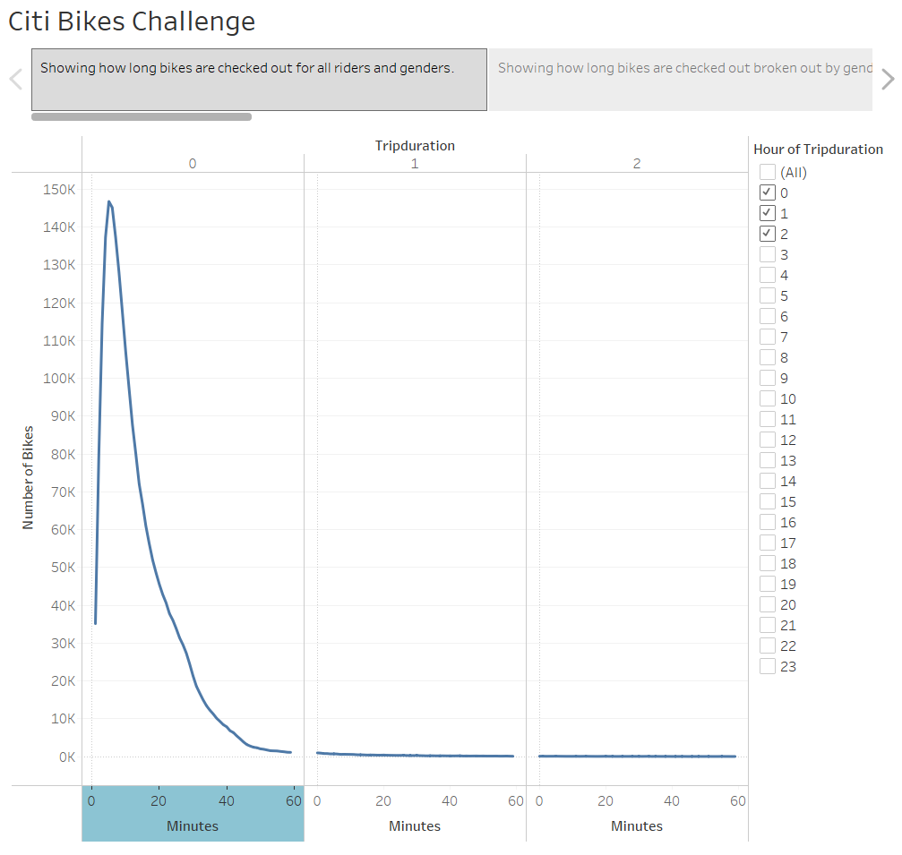
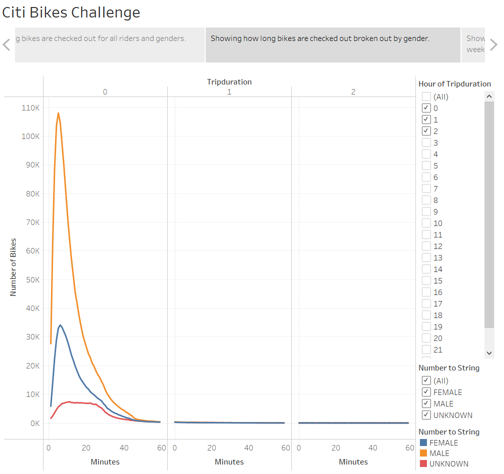
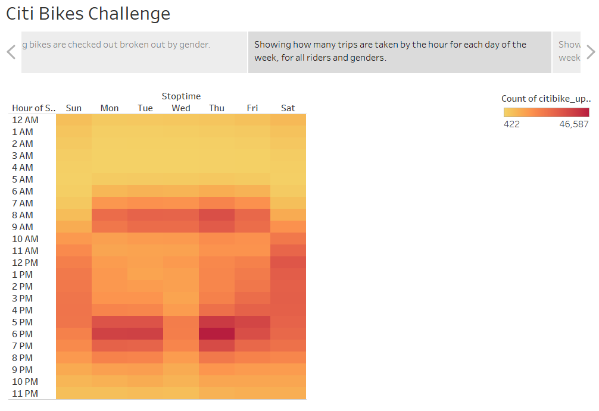
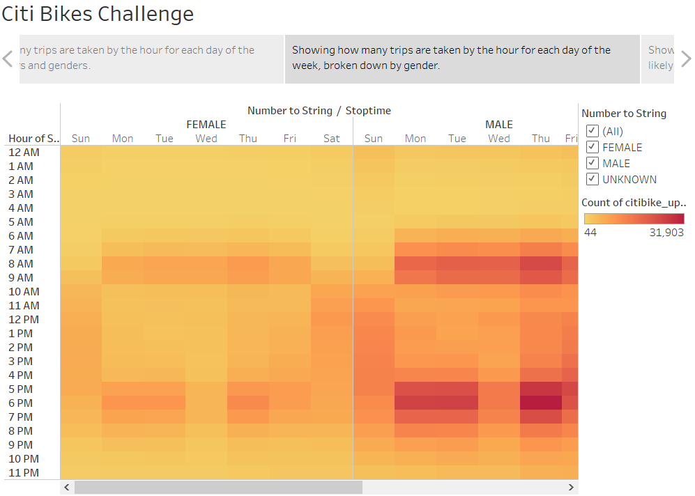
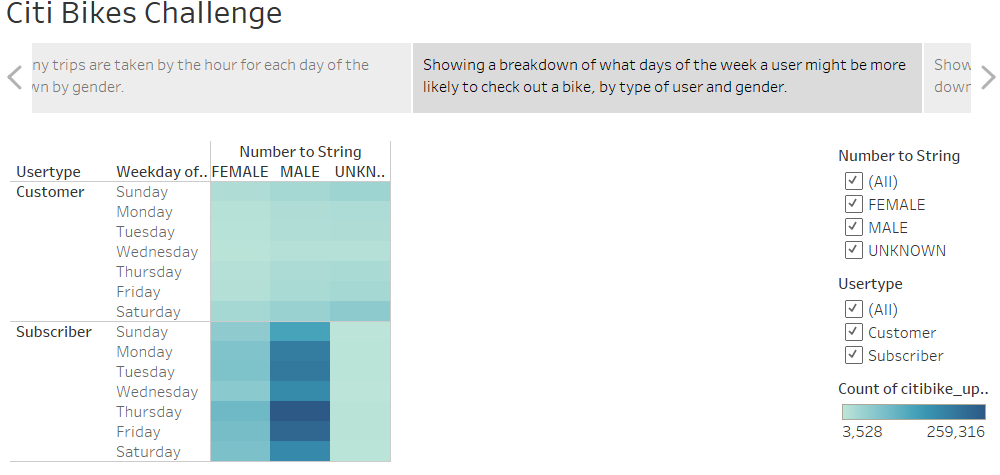
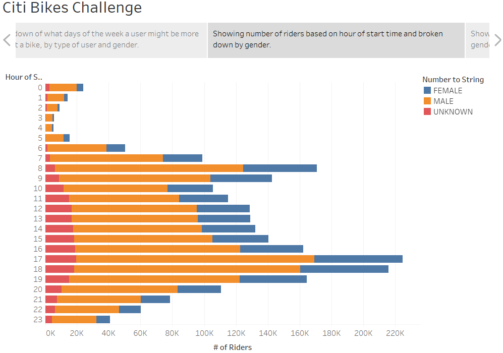
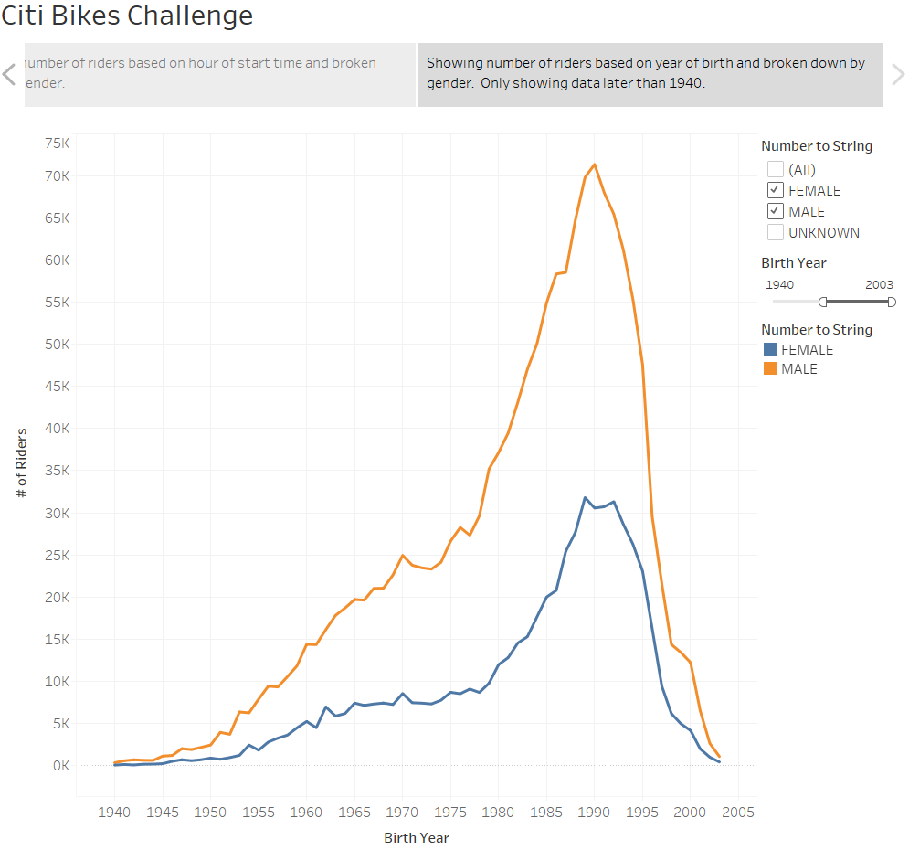

# bikesharing

## Overview of the Analysis
In this analysis Tableau is used to present a business proposal for a bike-sharing company. Data is imported, styled, and portrayed by creating worksheets, dashboards, and stories to visualize key data from a New York Citi Bike dataset.

This analysis and presentation is utilized to convince investors that a bike-sharing program in Des Moines is a solid business proposal. To solidify the proposal, one of the key stakeholders would like to see a bike trip analysis.

Raw data was downloaded from the openSource Citi Bikes company in New York City for the month of August as the core data for this analysis.

Once the .csv data is downloaded, using Python and Pandas dataframe techniques the "tripduration" column needed to be changed from an integer to a datetime datatype to get the time in hours, minutes, and seconds (00:00:00).  This new dataframe was exported to a new .csv file used for the analysis.

Then, using this newly converted .csv, visualizations were created in Tableau to:
- Show the length of time that bikes are checked out for all riders and genders
- Show the number of bike trips for all riders and genders for each hour of each day of the week
- Show the number of bike trips for each type of user and gender for each day of the week
- Create two additional analysis to further depict to the investors if this is a good business opportunity.  The additional analysis that was performed was:
    - Show the number of riders utilizing the bikes based on the hour of the day, broken down by gender
    - The number of riders utilizing bikes compared to the year they were born

Once these visualizations were create, a Story was created to summarize and paint the picture to the investors of the analysis and key outcomes of the analysis.

## Results
The completed Tableau Story is located on the Tableau Public Server Located here:
[link to dashboard](https://public.tableau.com/app/profile/scott.armstrong8079/viz/Citi_Bikes_Challenge/CitiBikesChallenge?publish=yes)

The seven visualizations for this challenge are also shown below with descriptions.
- Showing how long bikes are checked out for all riders and genders.  This shows that most amount of trips are less than 20 minutes overall.
    - 
- Showing how long bikes are checked out broken out by gender.  Similar to the previous graph, the highest volume of trips are less than 20 minutes, but Males are utilizing the service much more than Females.
    - 
- Showing how many trips are taken by the hour for each day of the week, for all riders and genders.  This heatmap shows that during the week, most rides occur during commute times, while weekends are generally spread out throughout the late morning and afternoon.
    - 
- Showing how many trips are taken by the hour for each day of the week, broken down by gender.  Similar to the previous heatmap, however, showing again that Males use the service much more than Females.
    - 
- Showing a breakdown of what days of the week a user might be more likely to check out a bike, by type of user and gender.  Indicates that for subscribers Males are much heavier users compared to Females.  For non-subscribers, there is not an obvious difference between Males and Females utilizing the service.
    - 
- Showing number of riders based on hour of start time and broken down by gender.  This chart predominately indicates that the peak times of usage are in the afternoon/evening commute hours, and still indicates higher usage by Males.
    - 
- Showing number of riders based on year of birth and broken down by gender.  Only showing data later than 1940.  Birth year indicates the age of the riders utilizing the service.  The predominant ages between men and women using the service are similar, with Males utilizing a higher total number of rides.
    - 

## Summary
In summary, to create a successful bike sharing company in Des Moines, the target audience should be Males born after 1980, who are encouraged to become subscribers to the service and utilize this service for commuting.  Attention should also be made to market this service to Females as a healthy and safe way to commute as well.  Subscribers should also be encourage to utilize the service on the weekends, along with non-subscribers and tourists as a great way to explore the city. 

Two additional visualizations for future analysis would be:
- Estimating the average repair/overhaul cost per maintenance visit, the data could outline the estimated repair costs of the entire fleet.
- Estimating the overall bike usage during the day and peak times, the total quantity of bikes could be estimated to ensure there are always enough bikes to go around, especially during peak times.